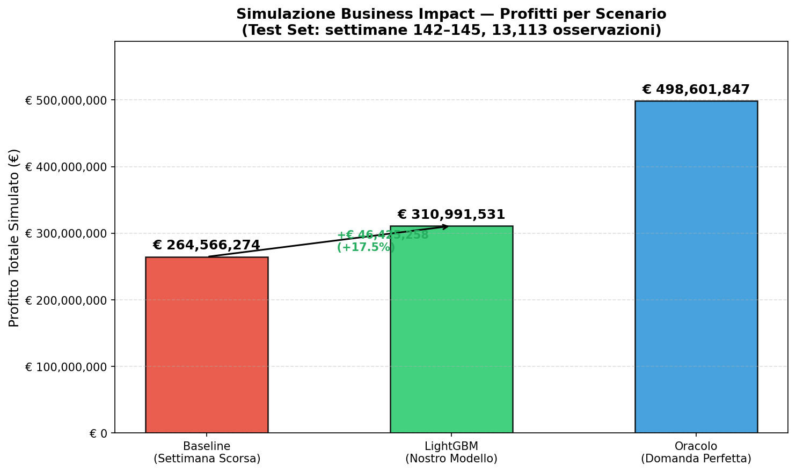

# Demand Forecasting System for SME Inventory Optimization (LightGBM)

## 📌 Introduzione e Obiettivo di Business
Questo progetto implementa un sistema di previsione della domanda a 14 giorni progettato per **ottimizzare l'inventario del magazzino** e **ridurre drasticamente gli sprechi** di prodotti deperibili.

La vera sfida non è stata semplicemente minimizzare un errore matematico (RMSE/MAE), ma risolvere un trade-off aziendale classico integrando variabili esogene (promozioni, festività, tipologia di prodotto) per superare i tradizionali approcci basati sulle medie storiche.

## 🎯 Lo Scoping
Il processo decisionale è stato modellato e diviso in due orizzonti strategici:
- **Breve termine (Cucina/Gestione interna):** Previsione granulare giornaliera per calibrare le preparazioni e ridurre lo spreco fisico (*waste*) derivato da over-stock.
- **Medio termine (Fornitori/Approvvigionamenti):** Pianificazione settimanale per l'ottimizzazione degli ordini delle materie prime, al fine di evitare le vendite perse a causa di rotture di stock (*stockout*).

## 🛠️ Data Engineering & Feature Extraction
Gran parte del valore generato risiede in una pipeline di preparazione dei dati robusta che trasforma "dati grezzi" in segnali predittivi puliti:

- **Gap Filling Intelligente:** Gestione rigorosa delle irregolarità. I giorni di assenza di transazioni (es. festività e chiusure) sono stati re-imputati con zero, mentre i valori anomali estremi (outliers da errore umano) sono stati normalizzati sfruttando le medie mobili settimanali.
- **Approccio "Agentic" (NLP-Based Feature Engineering):** Piuttosto che affidarsi unicamente a dati strutturati, ho sviluppato logiche in Python puro in grado di simulare l'estrazione intelligente del testo (ispirata agli approcci LLM) per estrarre la "Categoria Base" da campi testuali liberi (es. derivando "Pizza" da "Pizza Margherita Media").
- **Time-based Features & Lags:** Ingegnerizzazione di variabili ritardate (lags) e features di calendario (giorno di paga, weekend, trimestre), garantendo totale immunità da fenomeni di *Data Leakage*.

## 🧠 Il Modello: Perché LightGBM?
Il cuore predittivo dell'architettura si affida a **LightGBM** (Light Gradient Boosting Machine). 
La scelta tecnica di escludere complesse reti neurali è stata dettata da precisi requisiti industriali:
1. **Velocità ed Efficienza:** Tempi di addestramento irrisori e inferenza fulminea, ideali per retraining ad alta frequenza.
2. **Dominio dei Dati Tabulari:** L'algoritmo rappresenta lo stato dell'arte (SOTA) per le serie storiche con molte componenti categoriali e variabili esogene, riuscendo a mappare interazioni complesse senza richiedere un encoding massiccio.
3. **Robustezza:** Ha sovraperformato ampiamente la baseline operativa, garantendo predizioni robuste e "explainable".

## 💰 Risultati di Business Impact (Shadow Mode)
Il modello è stato testato su uno scenario di test rigoroso (4 settimane, oltre 13.000 combinazioni centro-piatto) calcolando un P&L reale basato su prezzi di checkout e food cost al 40%.
I risultati non sono solo metriche, ma **Euro risparmiati**. 

*Il modello ha ridotto drasticamente l'errore rispetto all'approccio a media mobile (settimana precedente), portando a un massiccio incremento di marginalità sulle vendite e riducendo l'inefficienza logistica.*

**📊 Valore Aggiunto vs Baseline (Metodo Tradizionale):**
- **Profitto Netto Aggiuntivo:** **+ € 46.425.258** *(Incremento del 17.55%)*
- **Sprechi evitati (Over-stock):** **- 148.096 unità** salvate dalla scadenza
- **Vendite perse recuperate (Stockout):** **- 78.500 unità** servite con successo

## 🚀 Next Steps e Deployment in Produzione
Attualmente il sistema è un solido prototipo eseguibile in ambiente locale. 
L'architettura in produzione proposta prevederebbe un approccio **Serverless** (es. tramite *AWS Lambda* o *GCP Cloud Functions*) per gestire in modo automatico la data pipeline e il retraining batch settimanale a bassissimo costo di infrastruttura.

Prima del roll-out completo per automatizzare gli ordini verso i fornitori, l'integrazione avverrà in **'Shadow Mode'** (affiancamento passivo al management reale). Questo step intermedio è cruciale per validare l'allineamento con le anomalie stagionali sul campo e, soprattutto, per **costruire fiducia (trust) e adozione da parte dei decision-maker aziendali**.
